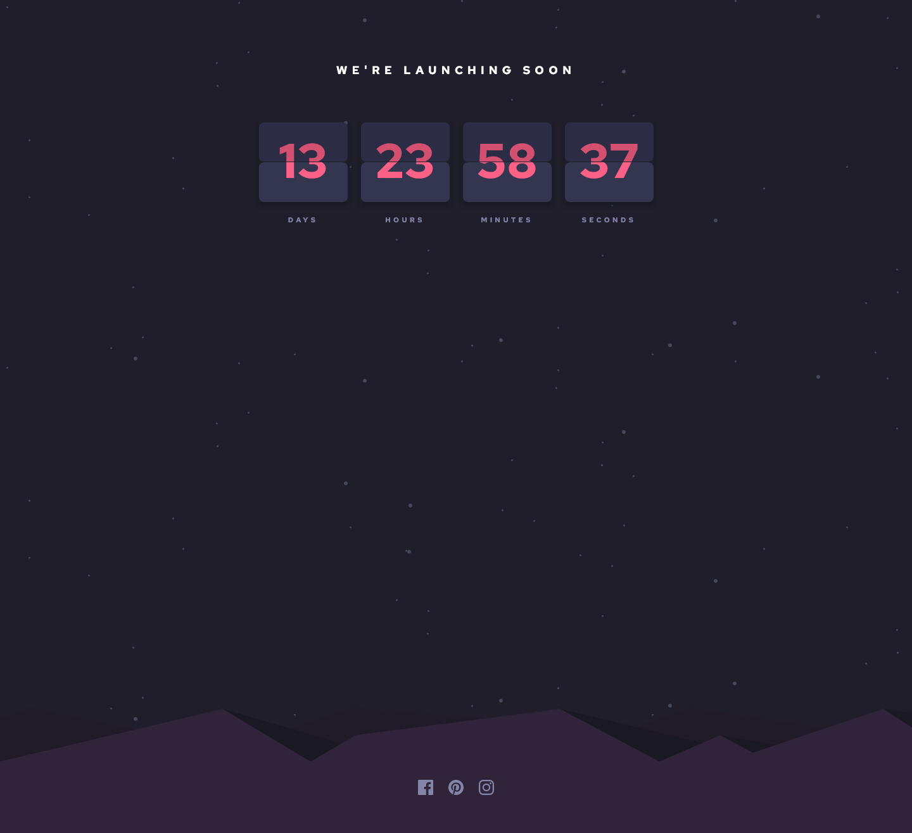

# Frontend Mentor - Launch countdown timer solution

This is a solution to the [Launch countdown timer challenge on Frontend Mentor](https://www.frontendmentor.io/challenges/launch-countdown-timer-N0XkGfyz-). Frontend Mentor challenges help you improve your coding skills by building realistic projects.

## Table of contents

- [Overview](#overview)
  - [The challenge](#the-challenge)
  - [Screenshot](#screenshot)
  - [Links](#links)
- [My process](#my-process)
  - [Built with](#built-with)
  - [What I learned](#what-i-learned)
  - [Continued development](#continued-development)
- [Author](#author)

## Overview

### The challenge

Users should be able to:

- See hover states for all interactive elements on the page
- See a live countdown timer that ticks down every second (start the count at 14 days)
- **Bonus**: When a number changes, make the card flip from the middle

### Screenshot

### Links

- Solution URL: [Add solution URL here](https://github.com/travdog95/launch-countdown-timer)
- Live Site URL: [Add live site URL here](https://travdog95.github.io/launch-countdown-timer/)

## My process

### Built with

- HTML5
- CSS variables
- Flexbox
- Media Queries
- JavaScript

### What I learned

I learned that you can have multiple background images and control them separately. I also learned putting your SVG element inline allows you to control attributes via CSS. I have been studying Flexbox a lot, so I used Flexbox all througout the project.

### Continued development

I didn't attempt to do the bonus challenge of animating the timer...I have no idea how to get that done! I also feel like my implmentation of displaying the numbers in the timer is a bit hacky...there's probably a better way to do it.

## Author

- LinkedIn - [Travis Peters](https://www.linkedin.com/in/travis-peters-09b4221/)
